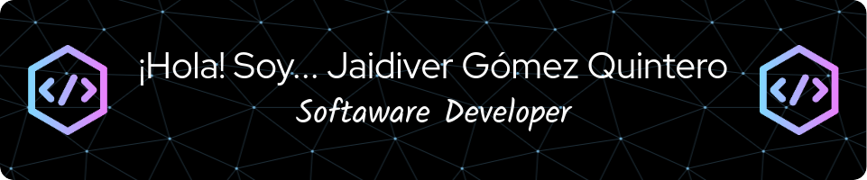

<!--
**jagoqui/jagoqui** is a ✨ _special_ ✨ repository because its `README.md` (this file) appears on your GitHub profile.

Here are some ideas to get you started:

- 🔭 I’m currently working on ...
- 🌱 I’m currently learning ...
- 👯 I’m looking to collaborate on ...
- 🤔 I’m looking for help with ...
- 💬 Ask me about ...
- 📫 How to reach me: ...
- 😄 Pronouns: ...
- ⚡ Fun fact: ...
-->
# 

Con más de 4 años de experiencia en el desarrollo de software, me apasiona la tecnología y disfruto aprendiendo constantemente. Mi enfoque laboral se caracteriza por la dedicación, la perseverancia y la paciencia. Me gusta invertir tiempo en mis tareas, explorando diversas alternativas para abordar cada problema de manera eficiente.

Siempre estoy en la búsqueda de formas innovadoras para enfrentar desafíos y mejorar mis habilidades. Mi compromiso radica en alcanzar la excelencia en mi trabajo, centrándome en encontrar soluciones eficientes y efectivas.

### Skills

