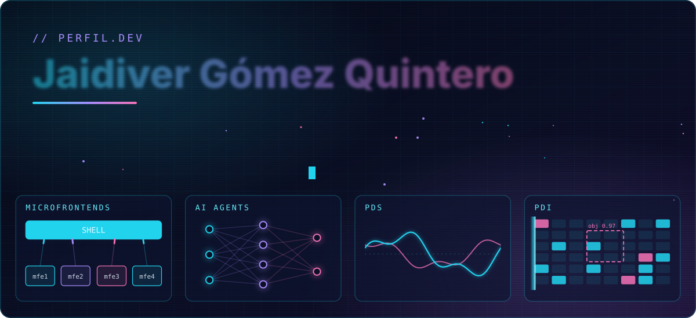

# Hola, soy Jaidiver Gómez Quintero

📍 Colombia · Desarrollador de Software Senior · Microfrontends y Agentes de IA

Construyo **microfrontends escalables** y **agentes de IA locales y en la nube** que aceleran el desarrollo de software sin sacrificar calidad ni seguridad. Cuento con más de 7 años de experiencia desarrollando soluciones para empresas como Sura, Bancolombia, Éxito y Nutresa, con Angular, React, Module Federation, LangChain y MCP.

[LinkedIn](https://www.linkedin.com/in/jaidiver-gomez-quintero/) · [Email](mailto:jaidivergomezquintero@gmail.com)

  

## Por dónde empezar

- **[Real Estate](https://github.com/jagoqui/real-estate-app)**: caso de estudio de arquitectura hexagonal de punta a punta, con React en el frontend y [.NET 9 en el backend](https://github.com/jagoqui/real-estate-api).
- **[Double V Microfrontends](https://github.com/jagoqui/double-v-github-users-app)**: caso de estudio de microfrontends con un shell en Next.js y remotes en Angular integrados con Module Federation.
- **[MCP Gateway](https://github.com/jagoqui/mcp-gateway)** *(laboratorio público, en desarrollo)*: gateway para exponer servidores MCP de forma segura sobre Streamable HTTP, con autenticación propia y enrutamiento con Caddy. Está diseñado con SDD y se entrega en PRs encadenados.

## Enfoque actual (septiembre 2026)

- Construir agentes de desarrollo que siguen estándares: Spec-Driven Development (SDD), harness engineering, agent plugins y validaciones determinísticas de arquitectura, pruebas y seguridad.
- Llevar agentes a la nube con LangChain, LangGraph y Deep Agents, protegidos con guardrails de PII y sandboxing.
- Diseñar interfaces para agentes apoyadas en mi experiencia en microfrontends y en protocolos como MCP, AG-UI y ACP.

## Proyectos

### Agentes de IA y MCP

- **[MCP Gateway](https://github.com/jagoqui/mcp-gateway)** *(en desarrollo)*: gateway MCP autogestionado con autenticación (tokens hasheados, cifrado AES-256-GCM) y despliegue en contenedores.
- **[AI Specs MERN](https://github.com/jagoqui/ai-specs-mern)**: convierte las convenciones de un proyecto MERN en especificaciones y comandos que los agentes siguen de forma consistente.

### Microfrontends

- **[Double V Microfrontends](https://github.com/jagoqui/double-v-github-users-app)**: repositorio de integración y despliegue con GitHub Actions y submódulos de Git.
  - [Shell en Next.js](https://github.com/jagoqui/double-v-container-app): SSR/SSG con TanStack Query, TanStack Table, Zod y shadcn.
  - [Remote de detalle](https://github.com/jagoqui/double-v-user-details) y [remote de seguidores](https://github.com/jagoqui/double-v-followers): Angular con Module Federation, RxJS e interceptores.

### Arquitectura full stack

- **[Real Estate App](https://github.com/jagoqui/real-estate-app)**: React, TanStack, Zod y Vitest sobre arquitectura hexagonal, con análisis de SonarQube.
- **[Real Estate API](https://github.com/jagoqui/real-estate-api)**: API REST en .NET 9 con MongoDB y NUnit, diseñada para ser modular y fácil de probar.

### Visión por computadora (archivo de aprendizaje)

- **[LSC-PDI](https://github.com/jagoqui/LSC-PDI)**: reconocimiento de Lengua de Señas Colombiana con Python, MediaPipe y OpenCV. Proyecto final del curso de Procesamiento Digital de Imágenes.

## Trayectoria

- Desarrollador en Experimentality, creando soluciones digitales para Sura, Bancolombia, Éxito y Nutresa con Angular (10-22), React (17-19) y TanStack. Hoy estoy en el equipo core de Canales Intermediados de Sura.
- Proyectos destacados: la migración de Evaluación Médica en Línea de Polymer a Angular, SIRE (inventarios y reabastecimiento para Éxito, con Module Federation y SSR), una librería de componentes UX/UI publicada en NPM y una librería de estilos con Lit para Siniestro Integral. En varios de ellos optimicé Web Vitals y SEO.
- Propuse el [transporte Streamable HTTP para MCP en Engram](https://github.com/Gentleman-Programming/engram/issues/1532), para hosts que no pueden instalar el binario.
- Estudiante de Ingeniería Electrónica en la Universidad de Antioquia, en los últimos semestres. De ahí vienen mis bases en C, C++, Assembler, FPGAs, electrónica análoga y digital, procesamiento digital de señales e imágenes, machine learning, redes de computadores y sistemas operativos.

Este GitHub reúne proyectos personales y de aprendizaje. No incluye código privado de empleadores ni de clientes, donde vive la mayor parte de mi trabajo profesional.

## Stack

| Área | Tecnologías |
|---|---|
| **Frontend** | Angular · React · Next.js · TypeScript · JavaScript · RxJS · TanStack · Zod · Tailwind · Module Federation · Web Components |
| **Renderizado y rendimiento** | SSR · SSG · CSR · Web Vitals · SEO |
| **UI y diseño** | Librerías de componentes y estilos · Design systems · Storybook · Figma · Adobe XD |
| **Desktop y mobile** | Electron · Extensiones de VS Code · Ionic · React Native · Kotlin · Android |
| **Backend** | Node.js · NestJS · Express · .NET · Python · Go · MongoDB · SQL |
| **IA y agentes** | LangChain · LangGraph · Deep Agents · MCP · SDD · Claude Code · Gemini · GitHub Copilot |
| **Visión por computadora** | OpenCV · MediaPipe · YOLO |
| **Calidad y seguridad** | Testing Library · Playwright · ESLint · Biome · SonarQube · Snyk · OWASP |
| **Cloud y plataforma** | Azure · AWS · Azure DevOps · Docker · Podman · Devcontainers · Linux |
| **Arquitectura** | Clean · Hexagonal · Screaming · DDD · Atomic Design · Container/Presentational · C4 |

## Contacto

[LinkedIn](https://www.linkedin.com/in/jaidiver-gomez-quintero/) · [Email](mailto:jaidivergomezquintero@gmail.com)

<!--
Owner: Jaidiver Gómez Quintero
Last reviewed: 2026-09-29
Review triggers: role or client change, new flagship project, merged open-source PR, job search.
-->
